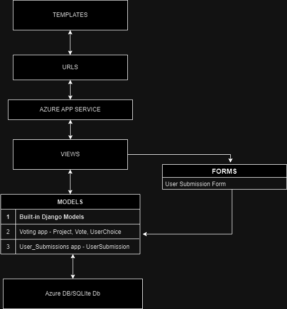

# City Voting Platform

## About
"City Voting Platform" is a website designed to empower citizens by allowing them to allocate funds to various projects across different districts of the city. Using this app, users can vote for existing projects, propose new ideas, and engage in discussions with other members of the community.

## Author
Nikita Pashchuk
- Email: pashchuknik@gmail.com
- Telegram: https://t.me/TakTakYa

## Getting Started:
To run the project, follow next steps:

1. Clone the repository: git clone https://github.com/NikitaPash/Pashchuk.University.CityVotingPlatform.git
2. Install dependencies: pip install -r requirements.txt
3. Run the development server: python manage.py runserver

## Documentation
### Introduction
City Voting Platform is the best desicion for goverment of a small city to connect with society in order to create better place for all to live in. Using user-friendly interface and a variety of instruments people can allocate funds to different city projects, communicate with each other and much more!

### Features
- User Authentication with Google account.
- Welcome Email upon registration.
- Project Voting System.
- Proposal Submission.
- Coming soon.

### Architecture
The City Voting Platform app follows a client-server architecture. The client-side is built using HTML, CSS, and Jinja, while the server-side is implemented with Django.
 

### Usage
To become a part of city's community, simply register or sign in with your Google account. Then, you can access different projects, choose the most interesting ones and help them to become a reality.

## Project Task Decomposition
Week 1 (02/27 - 03/06):
1. Implement feature: User Registration with Google Account ✔️
2. Set up Azure environment for deployment ✔️
3. Create Azure deployment pipelines ✔️
4. Write Getting Started documentation ✔️
5. Set up project repository on Github ✔️

Week 2 (03/06 - 03/13):
1. Implement feature: Welcome Email upon registration ✔️
2. Develop interactive map interface ✔️
3. Configure user authentication using OAuth 2.0 ✔️
4. Write initial project documentation ✔️
5. Set up Continuous Integration/Continuous Delivery (CI/CD) pipeline ✔️

Week 3 (03/13 - 03/20):
1. Implement feature: Project Voting functionality ✔️
2. Design database schema for projects and user data ✔️
3. Implement backend services for project management ✔️
4. Write unit tests for authentication and project services ✔️
5. Refine CI/CD pipeline for automated testing ✔️

Week 4 (03/20 - 03/27):
1. Implement feature: Proposal Submission ✔️
2. Develop project view functionality ✔️
3. Design frontend components for user interaction ✔️
4. Perform integration testing for user authentication and project functionalities ✔️
5. Update project documentation with architecture diagram ✔️

